# Jacksonville Housing Price Regression (R)

Multiple linear regression analysis of single-family home sale prices in west Jacksonville, FL.

> **Course project.** Completed for STAT 4043 (Applied Regression Analysis) at Oklahoma State University. Posted with my professor's permission.

## Overview

**Question:** Which physical characteristics of a home explain its sale price, and by how much?

**Data:** The Jaxhouse dataset, a random sample of 104 single-family home sales in zip code 32244 (west Jacksonville, FL), sold in the first half of 2019.

**Response:** `SalePrice` (USD)

**Predictors considered:** Bedrooms, Baths, GrossSF, HtdSF, Age2020, LotSF, Townhouse (Y/N), Pool (Y/N)

Two variables were excluded before modeling. `YearConst` is a perfect linear function of `Age2020`, so keeping both would cause exact collinearity. `AppJustVal2018` is the county appraiser's estimate from the year before sale, so including it would test whether last year's appraisal predicts this year's price instead of testing home characteristics.

## Approach

1. **Exploratory analysis.** Distributions, boxplots, correlations, and pairs plots. Gross and heated square footage were strongly correlated (r = 0.933), which flagged a multicollinearity risk.
2. **Full model and diagnostics.** All 8 predictors, then checks for linearity, constant variance, normality (Q-Q plots), multicollinearity (VIF), and influence (Cook's distance, leverage, studentized residuals). The full model had R² = 0.666.
3. **Remedial action.** Two high-influence sales (rows 103 and 104) were removed based on studentized residuals above 3 and large Cook's distances (n = 102 after cleaning). Row 88 had high leverage but low influence and was kept. After cleaning, the full model's R² rose to 0.779 and the Q-Q correlation rose from 0.936 to 0.969.
4. **Model selection.** AIC-based stepwise selection (forward and backward) chose four predictors: GrossSF, Age2020, Townhouse, and Pool. HtdSF was dropped, which also resolved the multicollinearity with GrossSF.
5. **Interaction search.** Stepwise selection over all two-way interactions among the four selected predictors added none, so the final model is additive.
6. **Final diagnostics.** Residual plots against fitted values and each predictor, Q-Q plot, Cook's distance, and VIFs. All final VIFs were between 1.12 and 1.43.

## Final model

| Term | Estimate (USD) | 95% CI |
|---|---|---|
| Intercept | 73,170.62 | n/a |
| GrossSF (per sq ft) | +59.09 | 47.75 to 70.43 |
| Age2020 (per year) | -888.16 | -1,188.83 to -587.49 |
| Townhouse (Y vs N) | -32,722.34 | -48,193 to -17,252 |
| Pool (Y vs N) | +30,754.69 | 11,357 to 50,152 |

**Fit:** R² = 0.7737, adjusted R² = 0.7644, residual standard error = $23,550 on 97 degrees of freedom, F = 82.92 on 4 and 97 df (p < 2.2e-16).

**Worked example:** A home with average size (1,957 sq ft) and age (about 31 years), not a townhouse and without a pool, has an estimated mean sale price of about $161,600 (95% CI $156,444 to $166,715). The 95% prediction interval for a single such home is wider, $114,562 to $208,597.

## Selected figures

### Exploratory analysis

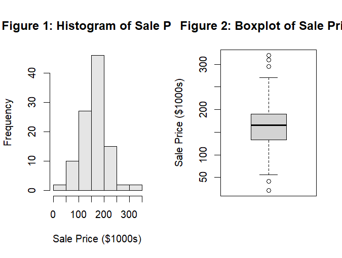

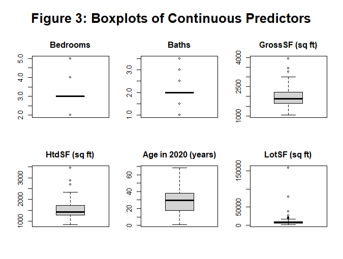

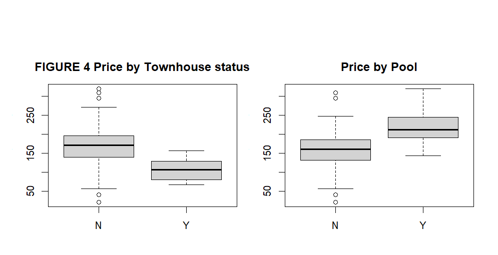

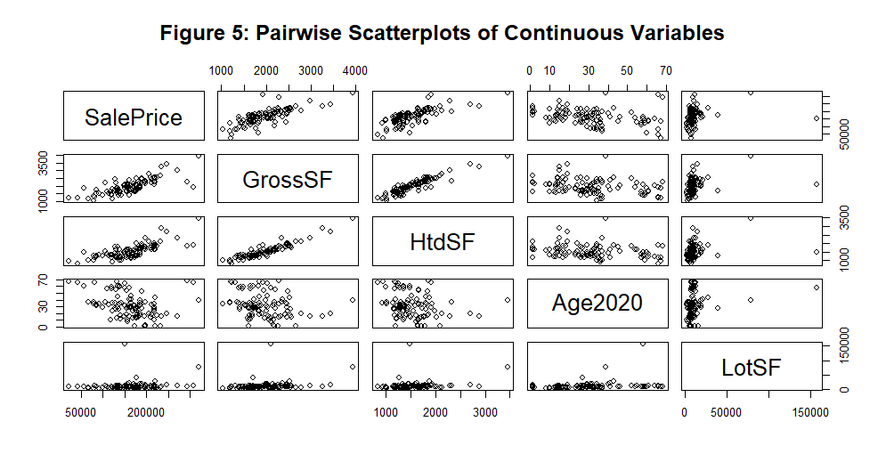

### Full-model diagnostics

Two extreme positive residuals (rows 103 and 104) stand out in the residual plot, and row 104 has a very large Cook's distance.

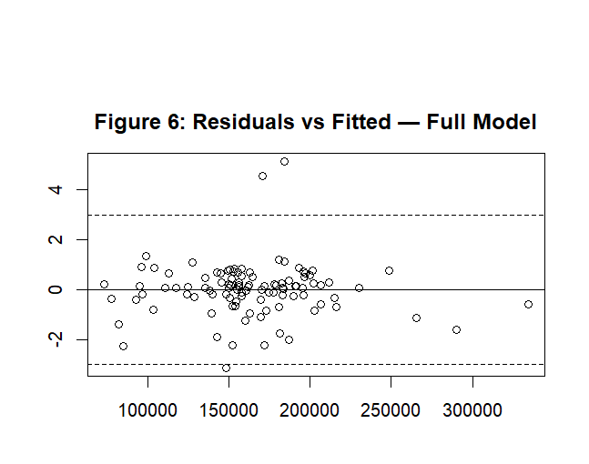

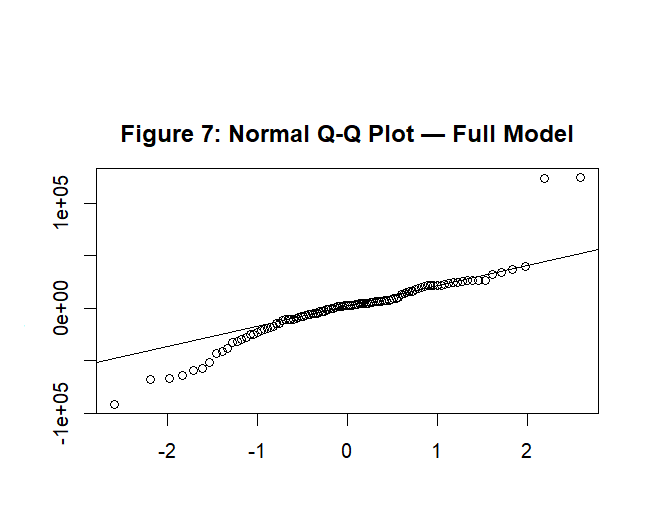

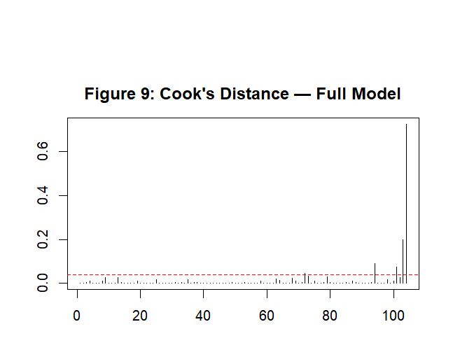

### After removing rows 103 and 104

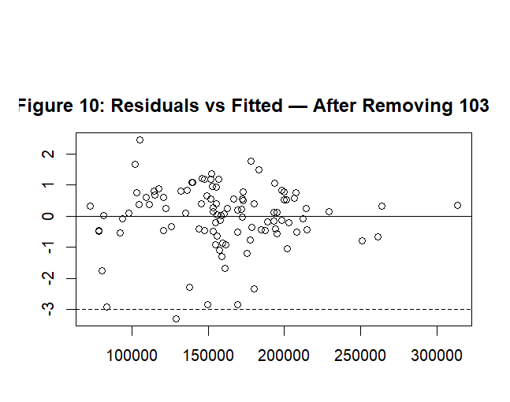

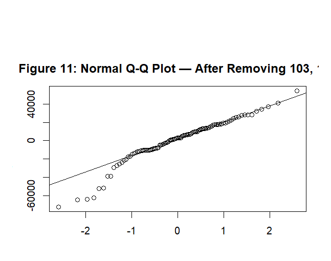

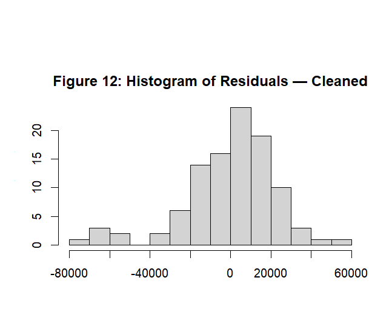

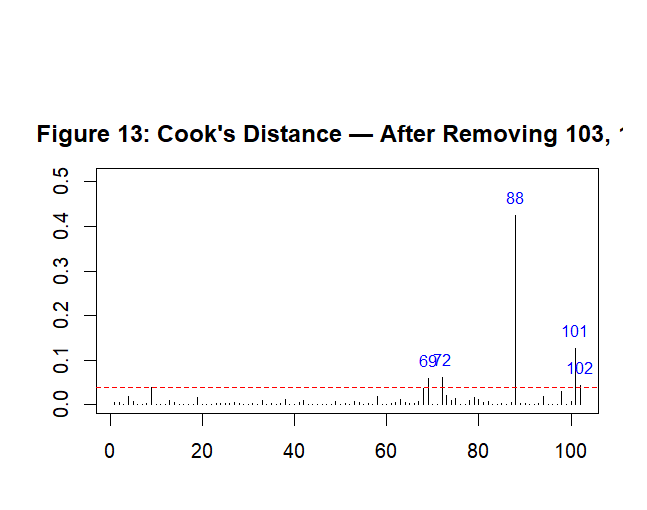

### Model selection

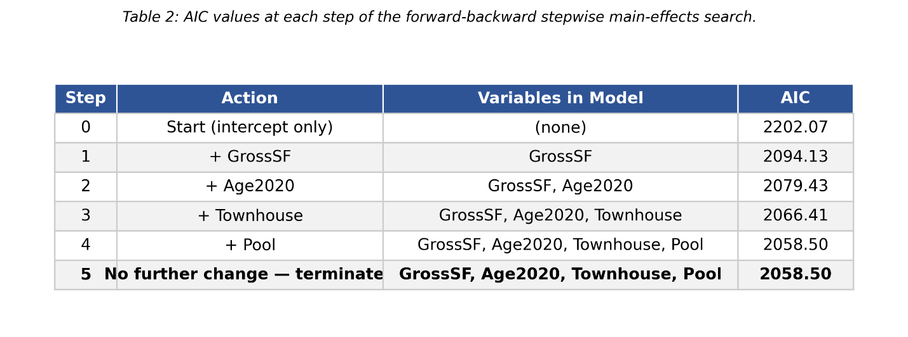

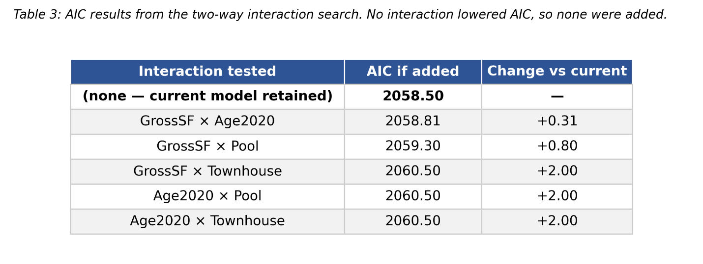

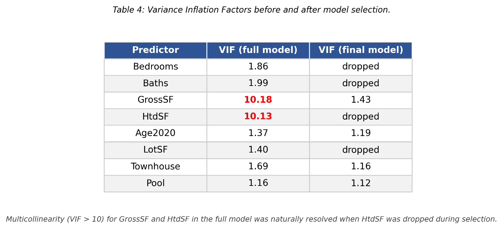

### Final model diagnostics

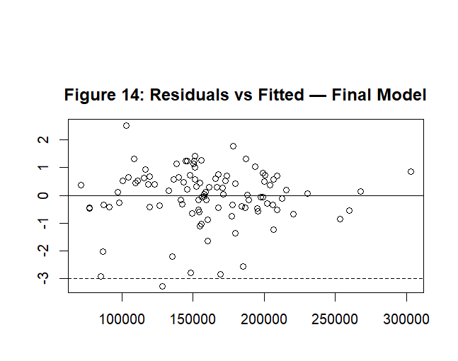

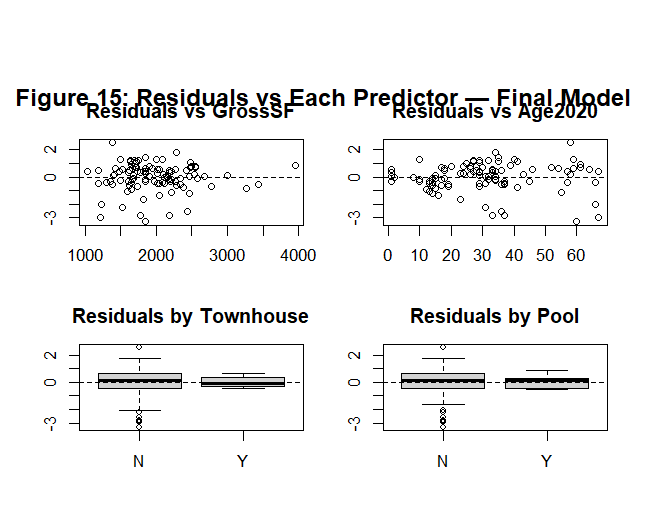

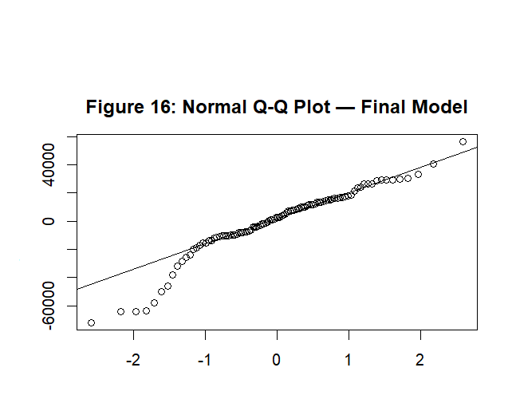

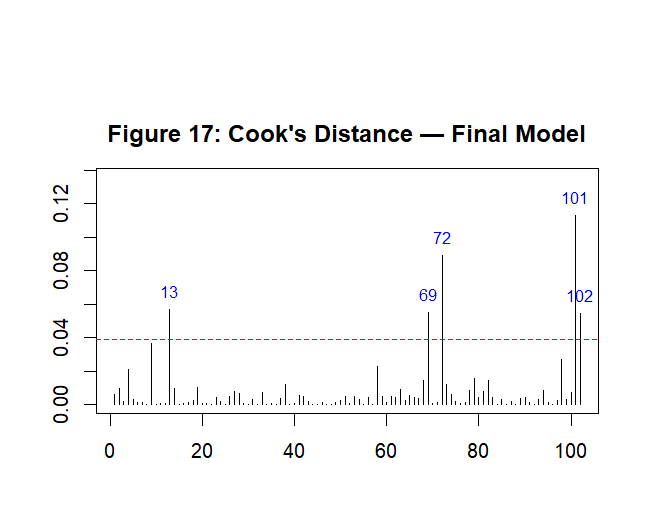

### Final coefficient table

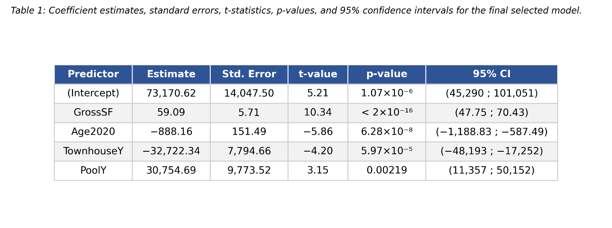

## Key findings

- Size matters most: each additional gross square foot is associated with about $59 more in sale price, holding the other variables constant.
- Each additional year of age is associated with about $888 less.
- Townhouses sell for about $32,700 less than comparable non-townhouses.
- Homes with a pool sell for about $30,800 more, but see the limitation below.
- Bedrooms, baths, heated square footage, and lot size added no explanatory value once the four selected predictors were in the model.

## Limitations

- Only 7 of the 104 homes have a pool, so the pool estimate is imprecise (wide confidence interval).
- The sample is small and covers a single zip code and a six-month window, so the results should not be generalized beyond that market.
- Observation 72 (a sale well below its appraised value) creates a mild lower-tail departure from normality. It may reflect non-physical factors, such as a distressed sale, that the model cannot capture.
- The model is explanatory and was not validated on held-out data.

## Repository contents

| File | Description |
|---|---|
| `housing_regression.R` | Full analysis script: exploration, diagnostics, model selection, final model, and predictions |
| `OdutolaOdunayoSamson_FinalProject.pdf` | Written report with all figures and interpretation (viewable directly on GitHub) |
| `OdutolaOdunayoSamson_FinalProject.docx` | Same report in Word format |
| `figures/` | Figures and tables from the report, shown above |

## How to run

1. Install R, then install the packages: `install.packages(c("car", "MASS"))`.
2. Place `Jaxhouse.csv` in the same folder as the script. The dataset was provided through the course and is not included in this repository.
3. Set that folder as your working directory and run `housing_regression.R`.

## Tools

R, with the `car` package (VIF) and the `MASS` package (studentized residuals).
